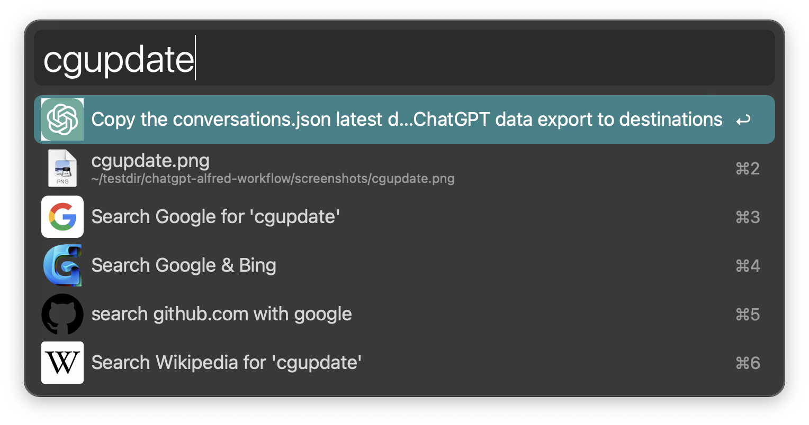

# ChatGPT Alfred Workflow

[Alfred](https://www.alfredapp.com/) Workflow that imports ChatGPT [exported](https://help.openai.com/en/articles/7260999-how-do-i-export-my-chatgpt-history-and-data) `conversations.json` file  
and provides a [`List Filter`](https://www.alfredapp.com/help/workflows/inputs/list-filter/) that let you do [**full-text search**](#chat-history-full-text-search)  and [**metadata filtering**](#metadata-filtering) on your chat history,  
supports [**previewing conversations**](#preview-of-conversations--opening-on-chatgpt--typingmind) (by using QuickLook on Markdown files generated from conversations)  
and opening them on ChatGPT or TypingMind.

- [ChatGPT Alfred Workflow](#chatgpt-alfred-workflow)
  - [Demo](#demo)
  - [Setting Up](#setting-up)
  - [Usage](#usage)
    - [Chat history full text search](#chat-history-full-text-search)
    - [Metadata filtering](#metadata-filtering)
    - [Preview of conversations \& Opening on ChatGPT / TypingMind](#preview-of-conversations--opening-on-chatgpt--typingmind)
    - [Searchable Fields](#searchable-fields)
  - [How it works](#how-it-works)

## Demo

<!-- <video>
https://github.com/tddschn/chatgpt-alfred-workflow/assets/45612704/da97397a-4813-4e16-b483-69d55e49c813
</video> -->

<!--  -->

https://github.com/tddschn/chatgpt-alfred-workflow/assets/45612704/da97397a-4813-4e16-b483-69d55e49c813


## Setting Up

Prerequisites: Install Alfred app and buy the PowerPack.

1. Clone this repository, edit `Makefile`'s first target (`update-workflow`) so that the `rsync` command syncs from the repo to your Alfred workflow directory.

```bash
git clone https://github.com/tddschn/chatgpt-alfred-workflow.git
cd chatgpt-alfred-workflow

# edit Makefile

# This workflow requires Python>=3.10
python3 -m pip install -r requirements.txt
# generate_preview_files.py requires tqdm
```

2. Export ChatGPT chat history, make sure the downloaded zip file is saved to `~/Downloads` for automatic imports and processing.  
See the official guide: https://help.openai.com/en/articles/7260999-how-do-i-export-my-chatgpt-history-and-data

3. Import the chat history to Alfred workflow by running `make regen-and-update-all` in the repo directory, or use the type in `cgupdate` in Alfred and press <kbd>Enter</kbd>, as shown in below.

Please note that the path to the this repo in the `cgupdate` script is hardcoded, so if you've cloned this repo to a different directory, you'll need to edit the script in Alfred Preferences.

You can also modify the hotkeys and keywords to your liking in Alfred Preferences.



## Usage

Use the hotkey <kbd>Cmd-Control-N</kbd> or the keyword `cg` to see a the full list of conversations, and start typing to search.


### Chat history full text search


### Metadata filtering

Filtering with metadata (model, model slug, creation time etc) is also supported:


### Preview of conversations & Opening on ChatGPT / TypingMind

Press <kbd>Enter</kbd> or click on the selected entry to open the conversation on ChatGPT,  
 press <kbd>Command-Enter</kbd> to open it on TypingMind (you'll need to import the `conversations.json` first on https://TypingMind.com),
 press <kbd>Shift</kbd> to preview the conversation in Alfred.


### Searchable Fields

```json
  {
    "id": "9b0891b4-19be-4275-9a34-44b9fec72f5b",
    "title": "ChatGPT Alfred Workflow Demo",
    "update_time": "2023-05-30T18:15:50",
    "create_time": "2023-05-30T18:15:32",
    "model_slug": "text-davinci-002-render-sha",
    "plugin_enabled": false,
    "linear_messages": [
      "say 'hi' and nothing more",
      "hi",
      "say it again",
      "hi"
    ]
  }
```

## How it works

- Making conversations linear  
  A conversation can have branches / forks if you've used the Edit feature in ChatGPT,  
  and from the exported JSON, you can see that a parent message contains a list of child messages. The `convert_chatgpt_conversations_json.py` script converts the exported json by extracting the last edited messages in the forks, i.e. the messages displayed in the ChatGPT UI, and outputs them to a new json file `linear_conversations.json`.
- Automatic discovery of exported ChatGPT `.zip` file (via filename regex matching and selecting the last-created one that matches) in `~/Downloads`,  
  and extracting the `conversations.json` file from it to the workflow directory:  
  handled by `update_conversations_json.py`.
- `generate_preview_files.py` generates a Markdown file for each of your conversations from `linear_conversations.json` and saves them to `./generated`, so that you can press <kbd>Shift</kbd> to preview the conversation in Alfred.
- [This function](https://github.com/tddschn/chatgpt-alfred-workflow/blob/77f49c98b00a0e1fc2b5eeb596608af4d655a8bc/utils.py#L58) make sure that the Alfred List Filter subtitles generated contains the user query in the middle ([example](#chat-history-full-text-search)).
